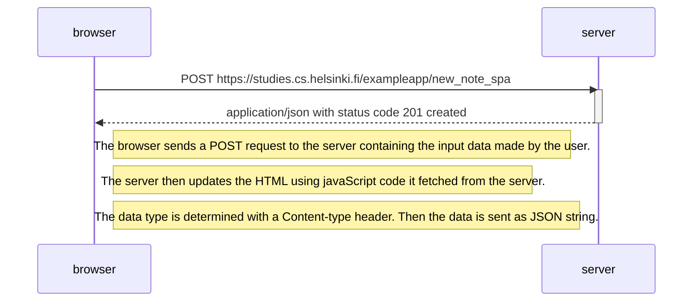

```mermaid

sequenceDiagram
    participant browser
    participant server

    browser->>server: POST https://studies.cs.helsinki.fi/exampleapp/new_note_spa
    activate server
    server-->>browser: application/json with status code 201 created
    deactivate server

    Note right of browser: The browser sends a POST request to the server containing the input data made by the user.
    Note right of browser: The server then updates the HTML using javaScript code it fetched from the server.
    Note right of browser: The data type is determined with a Content-type header. Then the data is sent as JSON string.
    

```
